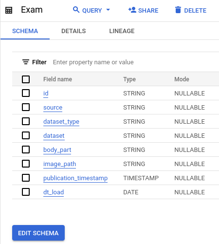
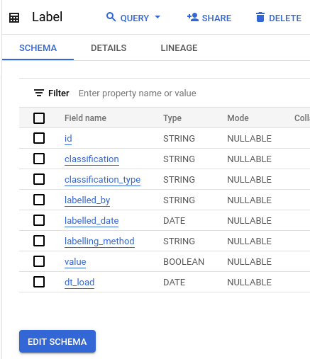
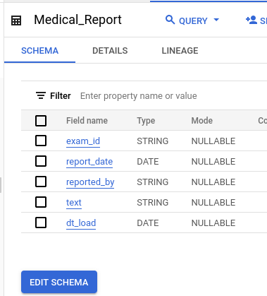
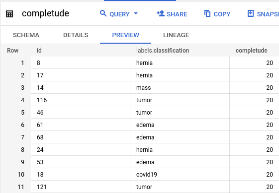
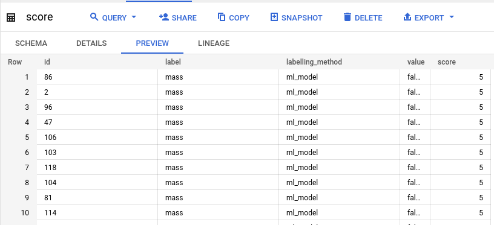
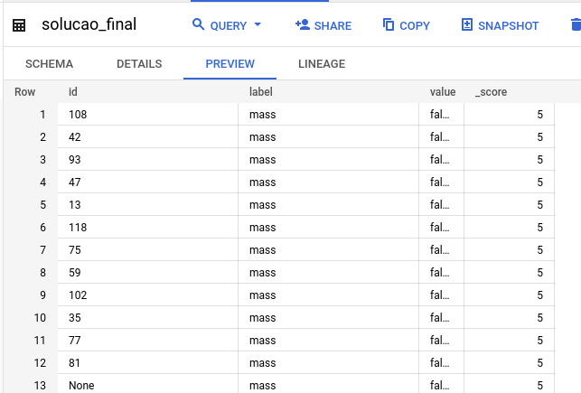

### Artefatos:
- Python
    - /dist/neuralmed-desafio-0.0.1.tar.gz  #  package com aplicação que faz a ingestão dos CSVs 
    - /src/pyspark/start.py  #  script para iniciar a aplicação

- SQLs
    - /src/bigquery/neuralmed_prep/raw_tables.sql  #  cria external tables apontando para os parquets no bucket
    - /src/bigquery/neuralmed_prep/completude.sql  #  cria a tabela de completude
    - /src/bigquery/neuralmed_prep/score.sql  #  cria a tabela com os scores
    - /src/bigquery/neuralmed_prep/solucao_final.sql  #  cria a tabela com a solução final
    - /src/bigquery/exec_bq.sh  #  script para executar as SQLs

### GCP
- Service Account: 
    - neuralmed-sa@centering-river-248712.iam.gserviceaccount.com
    
    Com as devidas roles configuradas:
    - BigQuery Data Editor
    - BigQuery Job User
    - Storage Object Creator
    - Storage Object Viewer 

- Bucket:
    - gs://neuralmed-tst

- BigQuery
    - Dataset: neuralmed_raw
    - External Tables:
        - Exam
        - Label
        - Medical_Report

    - Dataset: neuralmed_prep
    - Tables:
        - completude
        - score
        - solucao_final

### Sugestão de Arquitetura

### Ambiente de testes e desenvolvimento

1. Crie uma conta no GCP 
- Criar uma Service Account e gerar uma credencial json
- Criar um bucket
- Com os datasets no BigQuery
    - neuralmed_raw
    - neuralmed_prep

2. Configure no docker-compose.yaml as variaveis
    - GOOGLE_APPLICATION_CREDENTIALS
    - GCP_PROJECT_ID
    - CONFIG_SCHEMAS_FILE
    - RAW_BUCKET

3. Execute o setup.sh para:
    - bildar e instalar aplicação 
    - baixar e instalar os containers (apache-spark e google-sdk)

4. Execução manuais e testes dos jobs Spark
- Para entrar na console pyspark
    - docker-compose run apache-spark-py /opt/spark/bin/pyspark
- Para rodar as ingestões pelo spark-submit
    - docker-compose run apache-spark-py /opt/spark/bin/spark-submit /src/pyspark/start.py Exam
    - docker-compose run apache-spark-py /opt/spark/bin/spark-submit /src/pyspark/start.py Label
    - docker-compose run apache-spark-py /opt/spark/bin/spark-submit /src/pyspark/start.py Medical_Report

5. Para rodar os SQLs no Bigquery
- docker-compose run google-cloud-sdk /src/bigquery/exec_bq.sh raw_tables.sql
- docker-compose run google-cloud-sdk /src/bigquery/exec_bq.sh completude.sql
- docker-compose run google-cloud-sdk /src/bigquery/exec_bq.sh score.sql
- docker-compose run google-cloud-sdk /src/bigquery/exec_bq.sh solucao_final.sql

### Print(evidências) das Tabelas

### Links de referencia
- https://hub.docker.com/r/apache/spark-py
- https://hub.docker.com/r/google/cloud-sdk/
